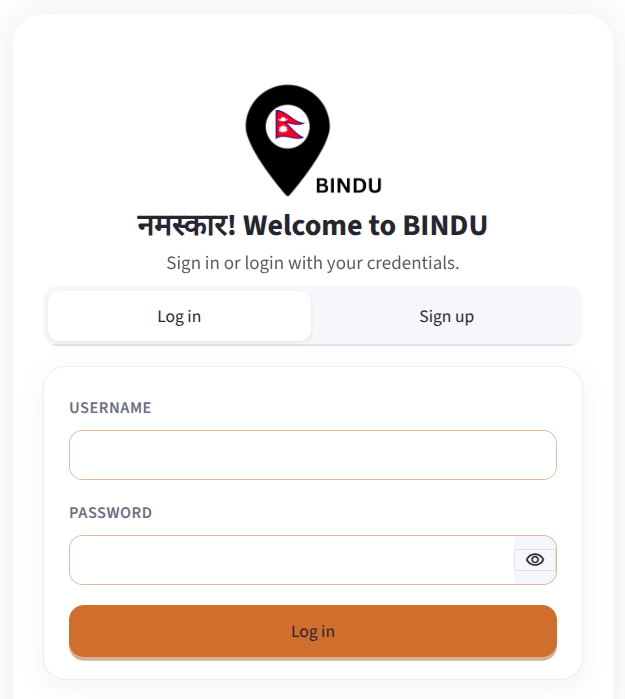
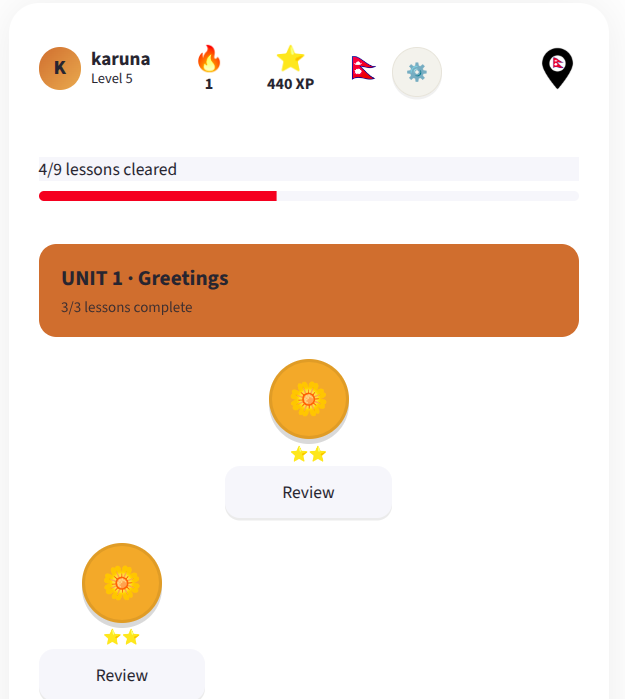
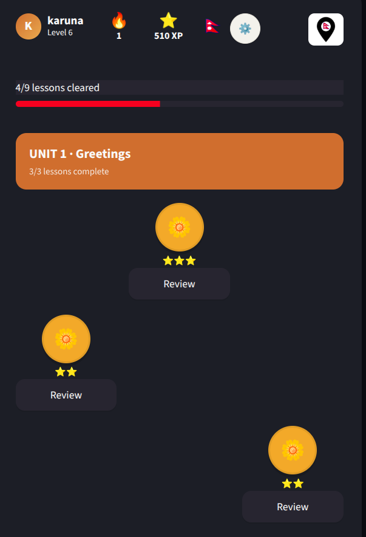
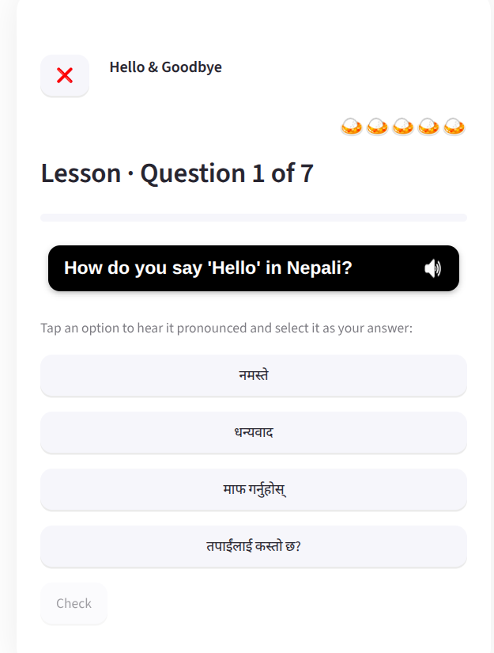
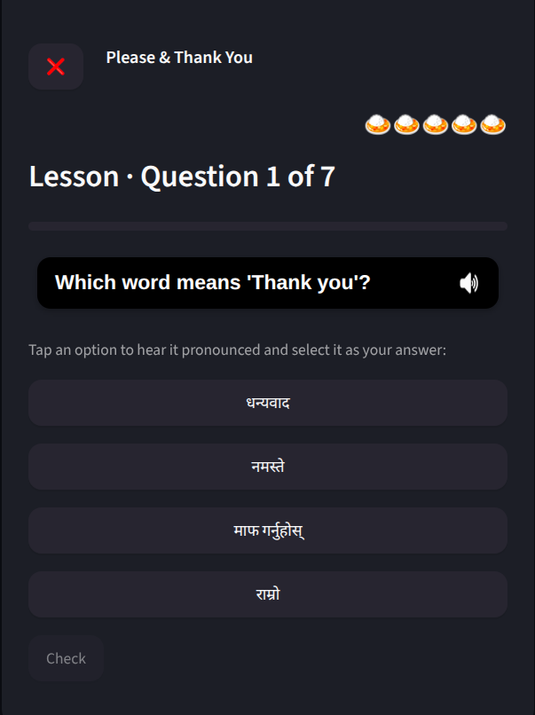
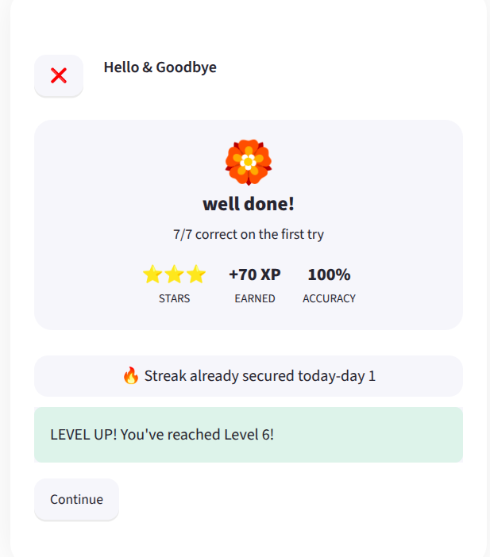

BINDU: Learn Nepali, one point at a time

BINDU is a lightweight,Nepali language-learning platform. It walks learners through short, focused lessons (multiple-choice and word-bank exercises) organized into themed units (Greetings, Numbers & Shopping, Food & Directions, and more), with hearts, XP, levels, and streaks to keep practice going.

## Features

- **Structured lessons**: units made of short lessons you unlock in order
- **Two exercise types**: multiple choice and word-bank (tap-the-tiles) translation
- **Hearts**: 5 hearts per session; a wrong answer costs one, and they refill over time
- **XP & levels**: earn XP as you complete lessons and level up
- **Streaks**: practice daily to keep your streak alive
- **Audio support** for pronunciation where available
- **Works fully offline**


## Installation

### 1. Clone the repository

```bash
git clone https://github.com/karkikaruna/bindu.git
cd bindu/bindu
```

If you're working from a zip file instead:
### Download the zip file directly from 

```bash
https://github.com/karkikaruna/bindu.git
unzip bindu.zip
cd bindu/bindu
```

### 2. Create an environment

Create a virtul environment.

**Option A: venv**

```bash
python3 -m venv .venv
source .venv/bin/activate      # Windows: .venv\Scripts\activate
pip install -r requirements.txt
```

**Option B: conda**

```bash
conda create -n bindu python=3.12 -y
conda activate bindu
pip install -r requirements.txt
```

## Running the app

From the `bindu/bindu` folder (the one containing `app.py`):

```bash
streamlit run app.py
```

Streamlit starts a local server and opens BINDU in your browser, typically at **http://localhost:8501**.


## cloud sync with Supabase

1. Create a free project at [supabase.com](https://supabase.com).
2. Run the schema in `supabase/schema.sql` against your project (the Supabase dashboard's SQL Editor works well).
3. Copy the example config and fill in your project's credentials:

   ```bash
   cp .streamlit/secrets.toml.example .streamlit/secrets.toml
   ```

   Then edit `.streamlit/secrets.toml`:

   ```toml
   SUPABASE_URL = "https://your-project.supabase.co"
   SUPABASE_ANON_KEY = "your-anon-public-key"
   ```

   (Alternatively, copy `.env.example` to `.env` and set the same values if you're not using Streamlit secrets.)

4. Re-run `streamlit run app.py`

## Project structure

```
bindu/
├── app.py                     # Main Streamlit app
├── bindu/
│   ├── data/                  # Local cache, Supabase client, repositories (auth, lessons, progress)
│   └── domain/                # Core logic: gamification, exercise validation, models
├── content/                   # Lesson content (units.yaml and variants) + content-generation scripts
├── scripts/                   # Translation & audio generation helpers
├── supabase/schema.sql        # Database schema for optional cloud sync
├── tests/                     # Unit tests
├── assets/                    # Logo, icons, images
├── requirements.txt
└── .streamlit/                # Streamlit theme + secrets template
```


## Troubleshooting

- **Port already in use**: run `streamlit run app.py --server.port 8502` (or any free port).
- **Reset local progress**: stop the app and delete `bindu_local.db`; a fresh one is created on next launch.

## Using BINDU

1. **Create an account**: sign up with a username (3–32 characters: letters, numbers, `.`, `_`, or `-`) and a password (4+ characters). Accounts are stored locally, so no email or internet connection is required.
2. **Pick a unit**: units appear on the home path in order; complete one to unlock the next.
3. **Work through lessons**: each lesson is a short sequence of exercises:
   - **Multiple choice**: pick the correct translation from a few options
   - **Word bank**: tap word tiles in the right order to build the translation
4. **Watch your hearts**: a wrong answer costs a heart; run out and you'll need to wait for hearts to refill before continuing that lesson.
5. **Earn XP and level up**: finishing lessons earns XP; every 100 XP is a new level.
6. **Keep your streak**: practicing daily keeps your streak counter climbing.
7. **Check your profile**: the Profile page shows your XP, level, hearts, and streak at a glance.

## Some snippets from the project
 
| | |
|---|---|
|  Login |  Home path |
|  Home path (dark mode) |  Lesson in progress |
|  Lesson in progress (dark mode) |  Lesson complete |


### Happy Learning with BINDU
